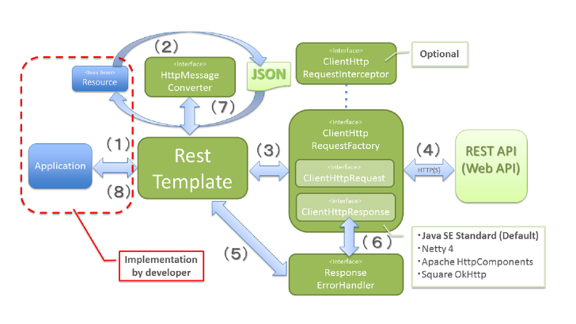
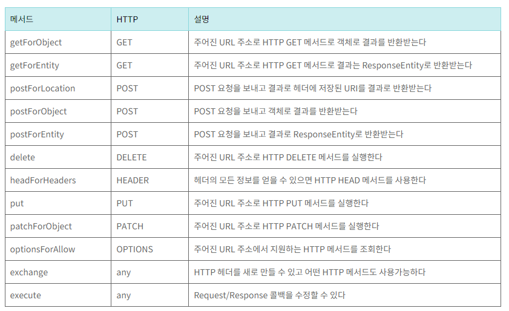
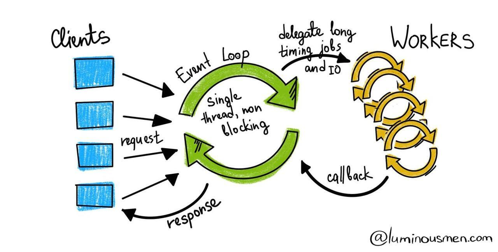

# Spring boot 외부 API 연동

## 외부 API 연동의 방법

- OkHttp3
- RestTemplate
- WebClient

### OkHttp3

효율적인 HTTP Client

- HTTP/2 지원을 통해 동일한 호스트에 대한 모든 요청이 소켓을 공유
- HTTP/2가 아니라도 연결 풀링은 요청 대기 시간을 줄여줌
- 투명 GZIP의 경우 다운로드 크기가 줄어듦
- 응답 캐싱은 반복 요청에 대해 네트워크를 완전히 회피
- 주로 애플리케이션에서 사용하지만 Spring (boot) 에서도 가능

#### 구성 방법

1. 의존성 추가  
   build.gradle에 해당 의존성을 추가한다

```grale
implementation 'com.squareup.okhttp3:okhttp:4.9.3'
```

2. HTTP Method 받기

2-1. GET

```java
public class OkHttpService {
	private final String BASE_URL = "BASE_URL_LINK";

	private OkHttpClient client;

	client = new OkHttpClient();

	public String get() {
		Request request = new Request.Builder.url(BASE_URL).build();

		Call call = client.newCall(request);
		Response response = call.execute();
		String responseBody = response.body().string();

		return responseBody;
	}
}
```

해당 예시 코드에서는,  
baseurl에서 요청을 받아서 해당 요청의 응답 부분을 toString()하여 리턴해준다

2-2. POST

- RequestBody 정의

```java
MediaType mediaType = MediaType.parse("application/json");
String requestBody = "{\"name\":\"John Doe\",\"email\":\"johndoe@example.com\"}";
RequestBody body = RequestBody.create(requestBody, mediaType);
```

- Request 만들기

```java
String url = "BASE_URL_LINK";
Request request = new Request.Builder()
        .url(url)
        .post(body)
        .build();
```

- Call 만들어 실행 (GET과 동일)

### RestTemplate

REST service의 endpoint를 호출하는 대표적인 방법 중 하나
그 중 동기 방식에 해당하는 케이스로 Spring 3.0부터 지원
REST API 호출 이후 응답을 받을 때까지 기다리는 방식

Multi-Threade와 Blocking 방식을 사용

- 시나리오에 대한 템플릿을 HTTP 방식으로 제공
- HTTP 서버와의 통신을 단순화
- RESTful 원칙을 지킴
- json, xml을 쉽게 응답 받을 수 있음
- 단순한 호출로 복잡한 작업을 쉽게 해줌
- REST service를 호출하도록 설계되어 HTTP protocol에 맞는 여러 Method를 제공

#### 동작 원리



1. Application이 RestTemplate을 생성하여, URI, HTTP Method 등 Header에 해당하는 부분을 담아 요청
2. RestTemplate은 HttpMessageConverter를 사용하여 requestEntity를 요청메시지로 변환
3. RestTemplate은 ClientHttpRequestFactory로 부터 ClientHttpRequest를 가져와서 요청을 보냄
4. ClientHttpRequest 는 요청메세지를 만들어 HTTP 프로토콜을 통해 서버와 통신
5. RestTemplate 는 ResponseErrorHandler 로 오류를 확인하고 있다면 처리로직 수행
6. ResponseErrorHandler 는 오류가 있다면 ClientHttpResponse 에서 응답데이터를 가져와서 처리
7. RestTemplate 는 HttpMessageConverter 를 이용해서 응답메세지를 java object(Class responseType) 로 변환
8. Application에 반환

#### 지원하는 Method



#### 구성 방법

1. 의존성 추가

build.gradle에 해당 의존성을 추가한다

```gradle
dependencies {
    implementation 'org.springframework.boot:spring-boot-starter-web:2.5.5'
    implementation 'com.fasterxml.jackson.core:jackson-databind:2.12.5'
}
```

2. RestTemplate 빈 등록하기 (optional)

Spring Boot Application에 RestTemplate 빈 등록  
@Bean 어노테이션으로 인스턴스 생성

```java
@Bean
public RestTemplate restTemplate() {
	return new RestTemplate();
}
```

만약 아래 3번의 예시에서 빈을 적용하고 싶다면 의존성 주입 등의 방법이면 가능할 듯?

3. HTTP Method 받기

3-1. GET

```java
RestTemplate restTemplate = new RestTemplate();
String url = "BASE_URL_LINK";
ObjectName obj = restTemplate.getForObject(url, ObjectName.class, 1);
```

매개변수로 전달될 값을 1로 해서 GET method 수행

3-2. POST

```java
RestTemplate restTemplate = new RestTemplate();
String url = "http://example.com/api/users";
User user = new User("John Doe", "johndoe@example.com");
User createdUser = restTemplate.postForObject(url, user, User.class);
```

### WebClient

REST service의 endpoint를 호출하는 대표적인 방법 중 하나
동기, 비동기 방식 모두 가능하기는 하지만 비동기 방식이라고 보는게 맞다

Single Thread와 Non-Blocking 방식을 사용



각 요청은 Event Loop내에 Job으로 등록  
Event Loop는 비동기식으로 Job을 처리 (반응형으로 동작)

Spring React 프레임워크를 사용  
Spring WebFlux에서 사용

#### 구성 방식

1. 의존성 추가  
   build.gradle에 해당 의존성을 추가한다

```grale
implementation 'org.springframework.boot:spring-boot-starter-webflux'
```

2. Config 파일 등록 (optional)

(실제 프로젝트의 WebClientConfig.java)

```java
@Configuration
public class WebClientConfig {

    @Bean
    public WebClient webClient() {
        HttpClient httpClient = HttpClient.create()
                .option(ChannelOption.CONNECT_TIMEOUT_MILLIS, 30000)
                .doOnConnected(conn ->
                        conn.addHandlerFirst(new ReadTimeoutHandler(5000, TimeUnit.MILLISECONDS))
                                .addHandlerFirst(new WriteTimeoutHandler(5000, TimeUnit.MILLISECONDS)));


        return WebClient.builder()
                .clientConnector(new ReactorClientHttpConnector((httpClient)))
                .build();
    }
}
```

3. HTTP Method 받기

3-1. GET

(실제 프로젝트의 LibService.java)

```java
@Service
@RequiredArgsConstructor
@Transactional(readOnly = true)
@Slf4j
public class LibService {
    @Value("${webclient.searchUrl}")
    private String SEARCH_URL;

    @Value("${webclient.statusUrlStart}")
    private String STATUS_URL_START;

    @Value("${webclient.statusUrlEnd}")
    private String STATUS_URL_END;

    @Value("${webclient.libSearchUrl}")
    private String LIB_SEARCH_URL;

    private final WebClient webClient;

    // 도서관 사이트 책 검색
    @Transactional
    public LibInfoResponseDto findInfo(String bookName) throws UnsupportedEncodingException, JsonProcessingException {
        ObjectMapper objectMapper = new ObjectMapper();

        // 책 이름으로 통합검색 (GET)
        URI infoUrl = URI.create(SEARCH_URL + URLEncoder.encode(bookName, "UTF-8"));
        log.info("[infoUrl] is " + infoUrl);

        String info = getAPI(infoUrl);

        // 응답 결과 중 필요한 내용만 파싱
        JsonNode infoJson = objectMapper.readTree(info);

        Long id = infoJson.path("data").path("list").path(0).path("id").asLong();
        String type = infoJson.path("data").path("list").path(0).path("biblioType").path("name").asText();
        String billNum = infoJson.path("data").path("list").path(0).path("branchVolumes").path(0).path("volume").asText();
        String thumbnailUrl = infoJson.path("data").path("list").path(0).path("thumbnailUrl").asText();

        String resultBookName = infoJson.path("data").path("list").path(0).path("titleStatement").asText();

        // 책 아이디로 도서관 책 상태 검색 (GET)
        URI statusUrl = URI.create(STATUS_URL_START + id + STATUS_URL_END);

        String status = getAPI(statusUrl);

        // 응답 결과 중 필요한 내용만 파싱
        JsonNode statusJson = objectMapper.readTree(status);
        int availableNum = 0;
        int entireNum = statusJson.path("data").path("totalCount").asInt();
        String location = "";

        LibInfoResponseDto libInfoResponseDto = LibInfoResponseDto.builder()
                .type(type)
                .billNum(billNum)
                .location(location)
                .thumbnailUrl(thumbnailUrl)
                .availableNum(availableNum)
                .entireNum(entireNum)
                .bookUrl(LIB_SEARCH_URL + id)
                .build();

        return libInfoResponseDto;
    }

    // 외부 API 호출 (GET)
    public String getAPI(URI url) {
        String response = webClient.get()
                .uri(url)
                .accept(MediaType.APPLICATION_JSON)
                .retrieve()
                .bodyToMono(String.class)
                .block();
        return response;
    }
}
```

3-2. POST

```java
import org.springframework.http.MediaType;
import org.springframework.web.reactive.function.client.WebClient;

// ...

WebClient webClient = WebClient.create("http://example.com");

webClient.post()
        .uri("/api/some-endpoint")
        .header("Content-Type", MediaType.APPLICATION_JSON_VALUE)
        .bodyValue("{\"name\": \"John\", \"age\": 30}")
        .retrieve()
        .bodyToMono(String.class)
        .subscribe(response -> {
            // Handle the response
        });
```

##### References

- [OkHttp3](https://velog.io/@yyong3519/OkHttp)
- [RestTemplate](https://velog.io/@seongwon97/Spring-Boot-Rest-Template)
- [WebClient(1)](https://gngsn.tistory.com/154)
- [WebClient(2)](https://icthuman.tistory.com/entry/Spring-WebClient-%EC%82%AC%EC%9A%A9-2-MVC-WebClient-%EA%B5%AC%EC%A1%B0)
- [WebClient(3)](https://github.com/inu-appcenter/winter-project-booking-server/blob/main/book-service/src/main/java/com/example/bookservice/service/LibService.java)
